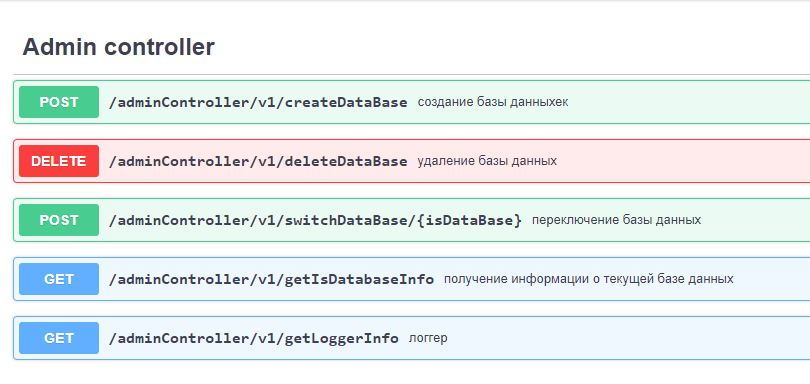
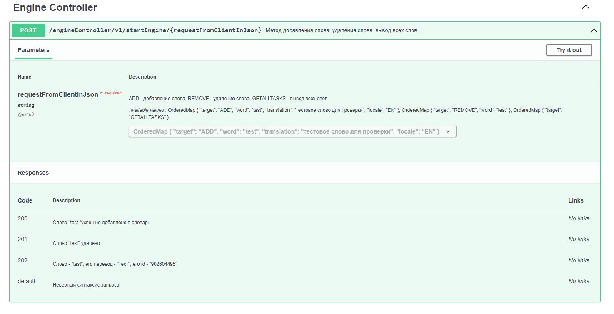

## Добро пожаловать в репозиторий RESP-API - приложения "Glossary"
Glossary
- API version: 0.0.1
  - Build date: 2022-07-21T12:56:34.978Z[GMT]

  For more information, please visit [https://github.com/Witcher26](https://github.com/Witcher26)


## Requirements

Building the API client library requires:
1. Java 1.7+
2. Maven

## Installation

### Maven users

Add this dependency to your project's POM:

```xml
<dependency>
  <groupId>io.swagger</groupId>
  <artifactId>swagger-java-client</artifactId>
  <version>1.0.0</version>
  <scope>compile</scope>
</dependency>
```
Then manually install the following JARs:

* `target/swagger-java-client-1.0.0.jar`
* `target/lib/*.jar`

## Documentation for API Endpoints

All URIs are relative to *http://localhost:8080/api*

Class | Method | HTTP request | Description
------------ | ------------- | ------------- | -------------
*AdminControllerApi* | [**createDataBase**](docs/AdminControllerApi.md#createDataBase) | **POST** /adminController/v1/createDataBase | создание базы данных
*AdminControllerApi* | [**deleteDataBase**](docs/AdminControllerApi.md#deleteDataBase) | **DELETE** /adminController/v1/deleteDataBase | удаление базы данных
*AdminControllerApi* | [**getIsDatabaseInfo**](docs/AdminControllerApi.md#getIsDatabaseInfo) | **GET** /adminController/v1/getIsDatabaseInfo | получение информации о текущей базе данных
*AdminControllerApi* | [**getLoggerInfo**](docs/AdminControllerApi.md#getLoggerInfo) | **GET** /adminController/v1/getLoggerInfo | логгер
*AdminControllerApi* | [**swichDataBase**](docs/AdminControllerApi.md#swichDataBase) | **POST** /adminController/v1/switchDataBase/{isDataBase} | переключение баз данных
*DatabaseControllerApi* | [**readDatabase**](docs/DatabaseControllerApi.md#readDatabase) | **GET** /databaseController/v1/database/read | Ммтод чтения данных из базы данных
*DatabaseControllerApi* | [**updateDatabase**](docs/DatabaseControllerApi.md#updateDatabase) | **PUT** /databaseController/v1/database/update | метод обнолвения базы данных
*EngineControllerApi* | [**engine**](docs/EngineControllerApi.md#engine) | **POST** /engineController/v1/startEngine/{requestFromClientInJson} | метод добавления слова, удаления слова, вывод всех слов

## Documentation for Models

 - [ErrorDataBase](docs/ErrorDataBase.md)
 - [SuccessDataBase](docs/SuccessDataBase.md)
 - [SuccessDeletedDataBase](docs/SuccessDeletedDataBase.md)
 - [SuccessSwitchDataBase](docs/SuccessSwitchDataBase.md)

## Documentation for Authorization

All endpoints do not require authorization.  
http://localhost:8080/swagger-ui/index.html

## Author

1816178@mail.ru

***
Для того, чтобы начать пользоваться данным REST-API, необходимо проделать следующие шаги:
+ ### развернуть приложение на компьютере и запустить его (Внимание, приложение необходимо развернуть на локальном компьютере, поскольку на удаленном сервере его нет).
+ ### запустить мануал по использованию:


+ ### выбрать браузер:


***
Перед вами откроется интерактивное окно API-интерфейса:
***


## либо можете воспользоваться альтернативным способом - перейдя по указанной ссылке, предварительно запустив приложение:
http://localhost:8080/swagger-ui/index.html

Результат будет таким же.

# **Первый блок - запросы администратора**
- переключение баз данных (return String, Available values : POSTGRESQL, MONGODB, by default MONGODB);
- удаление базы данных (return Boolean, No parameters);
- создание базы данных (return Boolean, No parameters);
- получение информации от логгера (return String, No parameters);
- получение информации о текущей базе данных (return String, No parameters).



# **Второй блок - запросы к базе данных**
- чтение из базы данных (return String, No parameters);
- обновление базы данных (return Boolean, No parameters);


# **Третий блок  - запросы взаимодействия с хранилищем**  
### Запрос представляет с собой json-строку
***
- ADD - добавление слова и его перевод (return Boolean, Available values:  { "target": "ADD", "word": "test", "translation": "тестовое слово для проверки", "locale": "EN" })
- Remove - удаление слова (return Boolean, Available values: { "target": "REMOVE", "word": "test" })
- GETALLTASKS - вывод всех слов (return String, Available values: { "target": "GETALLTASKS" })


**Пример интерактивного окна метода из группы контролера Engine**


