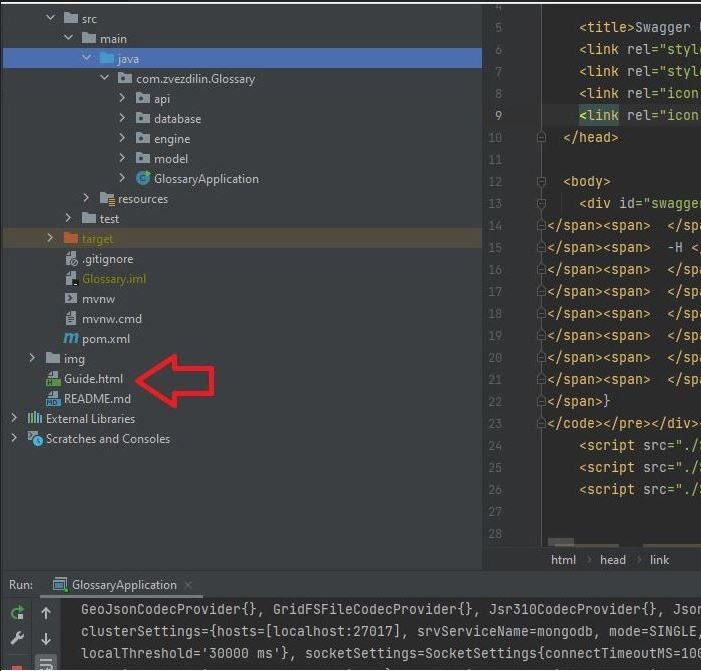

## Добро пожаловать в репозиторий RESP-API - приложения "Glossary"

***
Для того, чтобы начать пользоваться данным REST-API, необходимо проделать следующие шаги:
+  развернуть приложение на компьютере и запустить его (Внимание, приложение необходимо развернуть на локальном компьютере, поскольку на удаленном сервере его нет).
+ запустить мануал по использованию:

+ выбрать браузер:

Перед вами откроется интерактивное окно API-интерфейса:

либо можете воспользоваться альтернативным способом - перейдя по указанной ссылке, предварительно запустив приложение:
http://localhost:8080/swagger-ui/index.html

Результат будет таким же.

**Первый блок запросов - запросы администратора, такие как**
- переключение между базами данных;
- удаление базы данных;
- создание базы данных;
- получение информации от логгера
- получение информации о текущей базе данных:

**Второй блок запросов - запросы взаимодействия с базой данных**
- чтение из базы данных;
- обновление базы данных.

**Третий блок запросов - запросы взаимодействия с хранилищем**
- добавление слова и его перевод;
- удаление слова;
- вывод всех слов

**Пример интерактивного окна метода из группы контролера Admin**

На указанном красной стрелкой терминале выводится сообщение об удачном переключении базы данных